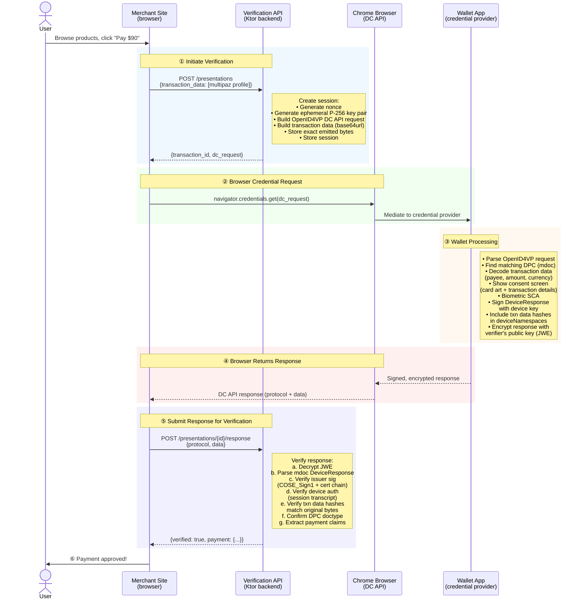

# Feature Specification: DPC Verifier Library

**Feature Branch**: `004-dpc-verifier`
**Created**: 2026-03-17
**Updated**: 2026-03-18
**Status**: Draft
**Input**: A reusable Ktor plugin that handles OpenID4VP verification of Digital Payment Credentials via the W3C Digital Credentials API. Merchants supply dynamic transaction data at request time. The library handles all protocol ceremony internally.

## Protocol Flow

The primary flow uses the **W3C Digital Credentials API** (`navigator.credentials.get()`) in Chrome. The browser mediates the wallet interaction — no QR code, no wallet-facing endpoints. The user browses on the same device as their wallet.

### Sequence Diagram: DPC Payment Verification via DC API



### Participants

| Participant | Role | Examples |
|-------------|------|---------|
| User | Person browsing the merchant's site and approving payment with their wallet. | Online shopper, airline passenger |
| Merchant Site | Website the user is browsing. Initiates verification, calls DC API, submits response, shows confirmation. | E-commerce checkout page |
| Verification API | Ktor backend endpoints. Creates sessions, builds DC API requests, verifies responses, returns results. | `POST /presentations`, `POST /presentations/{id}/response`, `GET /presentations/{id}` |
| Chrome Browser | Mediates the DC API call to the platform credential provider. Handles wallet discovery and response return. | Chrome 141+ with DC API support |
| Wallet App | Native app registered as a credential provider (via Android CredentialManager). Shows consent UI, signs response. | multipaz test app |

### Message Details

| Step | Description |
|------|-------------|
| ① | Merchant site calls `POST /presentations` with `transaction_data` (multipaz profile in Phase 1). The library creates a session, builds the OpenID4VP DC API request (using `openid4vp-v1-signed` protocol), and returns `transaction_id` + `dc_request` (the parameters for `navigator.credentials.get()`). |
| ② | Merchant site's JavaScript calls `navigator.credentials.get(dc_request)`. Chrome mediates to the wallet app registered as a credential provider on the device. |
| ③ | Wallet finds the matching DPC (mdoc), shows the user a consent screen with card details and transaction details, collects biometric approval, signs the DeviceResponse (binding transaction data hashes in deviceNamespaces), and encrypts it. |
| ④ | Chrome returns the signed, encrypted response to the merchant site's JavaScript. |
| ⑤ | Merchant site's JavaScript submits the response to `POST /presentations/{id}/response`. The verifier decrypts, runs the full verification pipeline (steps A-E), and returns the result directly. |
| ⑥ | Merchant site shows payment confirmation to the user. |

### Verification Pipeline

When the response is submitted (step ⑤), the verifier runs all checks atomically — every check must pass or the entire verification fails. No partial results.

#### Step A: Validate DC API Response, Decrypt, and Parse

| # | Action | Detail |
|---|--------|--------|
| A1 | Correlate session | Match `transaction_id` from URL path to session, verify session is in `requested` state |
| A2 | Validate protocol | Confirm `protocol` field is `openid4vp-v1-signed` |
| A3 | Validate response mode | Confirm the response is a DC API response (not `direct_post`) |
| A4 | Validate origin binding | Verify the origin in the DC API handover matches `expected_origins` from the request |
| A5 | Decrypt JWE | Using the session's ephemeral private key |
| A6 | Detect credential format | Route to the appropriate format verifier via the SPI (mdoc in Phase 1) |
| A7 | Parse mdoc DeviceResponse | Extract `issuerSigned` and `deviceSigned` structures |

#### Step B: Verify the Card (is this credential real?)

| # | Check | What it proves | Fails if |
|---|-------|---------------|----------|
| B1 | Issuer signature (COSE_Sign1) | The DPC was signed by a real issuer | Forged credential |
| B2 | Certificate chain validation | The issuer is trusted by the trust manager | Untrusted or revoked issuer |
| B3 | Credential expiry | The DPC has not expired (`expiry_date >= now`) | Expired credential |
| B4 | Doctype confirmation | The credential is `org.multipaz.payment.sca.1` | Wrong credential type |
| B5 | Payment instrument presence | `payment_instrument_id` exists in issuer-signed claims | Incomplete credential |

#### Step C: Verify the Device (is this the right device?)

| # | Check | What it proves | Fails if |
|---|-------|---------------|----------|
| C1 | Device key match | The device key in the response matches the key certified by the issuer in `issuerAuth` | Cloned credential on a different device |
| C2 | Device authentication | The `deviceAuth` signature is valid against the DC API session transcript (`OpenID4VPDCAPIHandover`) | Replayed or tampered response |

#### Step D: Verify the Transaction (did the user approve this exact payment?)

| # | Check | What it proves | Fails if |
|---|-------|---------------|----------|
| D1 | Hash count | Number of hashes in `deviceNamespaces` matches number of transaction data items sent | Missing or extra transaction data |
| D2 | Hash algorithm | Algorithm matches what was requested (SHA-256) | Algorithm mismatch |
| D3 | Hash values (byte-exact) | Each hash matches SHA-256 of the exact stored emitted bytes | Tampered amount, payee, or currency |

#### Step E: Extract and Return

| # | Action | Output |
|---|--------|--------|
| E1 | Extract DPC claims | `instrument_id`, `holder_name`, `masked_account_ref`, `issuer_name` |
| E2 | Build result | `verified: true`, `credential_format: "mdoc"`, payment claims, `txn_data_verified: true` |

If any check in steps B, C, or D fails, the result is `verified: false` with an `error` identifying which check failed and a human-readable `error_description`.

## Developer Experience

This is what a merchant developer writes to get a fully functional DPC verifier:

### Backend Setup (11 lines of Kotlin)

```kotlin
fun main() {
    embeddedServer(Netty, port = 8080) {
        install(ContentNegotiation) { json() }
        install(DpcVerifier) {
            baseUrl = "https://merchant.example.com"
            trustManager = TrustManager(loadCerts("certs/"))  // optional
        }

        routing {
            dpcVerification("/pay")
        }
    }.start(wait = true)
}
```

This registers three endpoints:
- `POST /pay/presentations` — initiate verification, get DC API request parameters (201 Created)
- `POST /pay/presentations/{id}/response` — submit DC API response for verification (200)
- `GET /pay/presentations/{id}` — poll for result (200/202/404)

Plus a static JS SDK:
- `GET /pay/sdk.js` — served automatically for frontend integration

### Frontend Integration (1 script tag + button handler)

```html
<script src="/pay/sdk.js"></script>
<button onclick="handlePayment()">Pay $90.00</button>
<script>
  async function handlePayment() {
    // MUST be called from a user gesture (click/tap) —
    // navigator.credentials.get() requires transient user activation
    const result = await multipazDpcVerify({
      payee: { name: "Delta Airlines", id: "merchant-delta-001" },
      amount: "90.00",
      currency: "USD"
    });
    if (result.verified) {
      document.getElementById("status").textContent = "Payment approved!";
    }
  }
</script>
```

**Important**: The DC API requires **transient user activation** — `navigator.credentials.get()` must be called in direct response to a user gesture (click, tap). The SDK enforces this by checking `navigator.userActivation.isActive` and throwing a clear error if called outside a gesture handler.

The SDK handles everything: POST to `/presentations`, call `navigator.credentials.get()`, POST the response to `/presentations/{id}/response`, return the verified result.

### What the developer does NOT touch

Session management, nonce generation, ephemeral key pairs, DCQL query construction, OpenID4VP request building, JWE decryption, mdoc DeviceResponse parsing, COSE_Sign1 signature verification, device authentication, transaction data hash verification, trust chain validation, DC API protocol handling — all hidden inside the plugin and SDK.

## Standards Alignment

The library is built on **OpenID4VP 1.0 + HAIP 1.0 as the core protocol engine**, delivered via the **W3C Digital Credentials API** in Chrome. The multipaz DPC profile ships in Phase 1; **TS12 is the first extension added via the format SPI** in a future release.

| Standard | Body | Status | Role in this library |
|----------|------|--------|---------------------|
| [W3C Digital Credentials API](https://www.w3.org/TR/digital-credentials/) | W3C | Working Draft (March 2026) | **Primary transport.** Browser-mediated credential presentation via `navigator.credentials.get()`. |
| [OpenID4VP 1.0](https://openid.net/specs/openid-4-verifiable-presentations-1_0.html) | OpenID Foundation | Finalized (July 2025) | **Core protocol engine.** `openid4vp-v1-signed` protocol within the DC API, `transaction_data` parameter, DCQL, session encryption. |
| [HAIP 1.0](https://openid.net/openid4vc-high-assurance-interoperability-profile-haip-1-0-final-specification-approved/) | OpenID Foundation | Finalized | **Core protocol profile.** Mandates signed requests, response encryption. |
| [TS12 — Electronic Payments SCA with Wallet](https://github.com/eu-digital-identity-wallet/eudi-doc-standards-and-technical-specifications/blob/main/docs/technical-specifications/ts12-electronic-payments-SCA-implementation-with-wallet.md) | EUDI | Published | **Payment profile.** Transaction data schemas, verification requirements. |
| multipaz DPC (Phase 1A/1B) | OWF multipaz | Implemented | mdoc-based DPC with `org.multipaz.payment.sca.1`. Test wallet with DC API support. |

### Protocol Choice: `openid4vp-v1-signed`

The DC API supports multiple protocols. We use `openid4vp-v1-signed` because:
- **Transaction data support**: The `org-iso-mdoc` protocol does NOT support transaction data in the current multipaz codebase (throws `IllegalArgumentException`). Transaction data binding is the core of DPC verification.
- **TS12 alignment**: TS12 is built on OpenID4VP. Using it in the DC API keeps the protocol consistent.
- **Format flexibility**: OpenID4VP supports both mdoc and SD-JWT VC through the same protocol, enabling the format SPI without transport changes.

### Credential Format: mdoc First, Format SPI from Day One

The library ships with **mdoc support** as the production target for Phase 1. SD-JWT VC support is designed into the architecture via a **format SPI** but ships when TS12-compliant test vectors or wallets are available.

### Transaction Data Profiles

The Phase 1B multipaz wallet and TS12 use **different transaction data schemas**. These are treated as **separate profiles with no silent coercion**.

| Aspect | multipaz profile | TS12 profile |
|--------|-----------------|--------------|
| Type identifier | `org.multipaz.transaction_data.payment` | `urn:eudi:sca:payment:1` |
| Amount type | string (`"90.00"`) | number (`90.00`) |
| Hash alg field | array (`["sha-256"]`) | string (`"sha-256"`) |
| Payload wrapper | None (flat) | `payload` object |

**Phase 1**: Emits only the multipaz profile. **Future**: TS12 profile added via format SPI. The multipaz profile is transitional.

### API Design

The verifier exposes **three HTTP endpoints** plus a static JS SDK:

| Endpoint | Audience | Purpose |
|----------|----------|---------|
| `POST {path}/presentations` | Merchant backend/JS | Initiate verification, return DC API request parameters |
| `POST {path}/presentations/{id}/response` | Merchant JS (via SDK) | Submit DC API response for verification |
| `GET {path}/presentations/{id}` | Merchant backend | Poll for result (if not using synchronous response from step ⑤) |
| `GET {path}/sdk.js` | Merchant frontend | JS SDK that handles the DC API ceremony |

**Note**: Wallet-facing endpoints (`GET /wallet/request.jwt/{id}`, `POST /wallet/direct_post`) are NOT needed for the DC API flow. They may be added as an optional cross-device extension in a future release.

#### `POST {path}/presentations` — Initiate Verification

**Request** (`application/json`) — multipaz transaction data profile:
```json
{
  "transaction_data": [
    {
      "type": "org.multipaz.transaction_data.payment",
      "credential_ids": ["payment_cred"],
      "transaction_data_hashes_alg": ["sha-256"],
      "transaction_id": "txn-abc-123",
      "payee": { "name": "Delta Airlines", "id": "merchant-delta-001" },
      "currency": "USD",
      "amount": "90.00"
    }
  ]
}
```

**Response** (201 Created, `application/json`):
```json
{
  "transaction_id": "a1b2c3d4e5f6...",
  "dc_request": {
    "digital": {
      "requests": [{
        "protocol": "openid4vp-v1-signed",
        "data": "eyJ..."
      }]
    },
    "mediation": "required"
  }
}
```

The `dc_request` object is passed directly to `navigator.credentials.get()` per the [W3C Digital Credentials API](https://www.w3.org/TR/digital-credentials/) spec. The `requests` array uses the standard `DigitalCredentialRequestOptions` shape with `protocol` + `data` fields. The signed OpenID4VP request in `data` includes `expected_origins` for origin binding. The SDK handles this automatically.

#### `POST {path}/presentations/{id}/response` — Submit DC API Response

The merchant's JS submits the `DigitalCredential` object returned by `navigator.credentials.get()`. The SDK extracts `protocol` and `data` from the credential and posts them.

**Request** (`application/json`):
```json
{
  "protocol": "openid4vp-v1-signed",
  "data": "eyJ..."
}
```

These fields map directly to the `DigitalCredential` interface: `credential.protocol` and `credential.data`. The `data` field contains the JWE-encrypted OpenID4VP response.

**Response** (200 OK — verification result returned synchronously):
```json
{
  "verified": true,
  "credential_format": "mdoc",
    "doctype": "org.multipaz.payment.sca.1",
  "payment": {
    "instrument_id": "tok-abc-123",
    "holder_name": "Jane Doe",
    "masked_account_ref": "*4242",
    "issuer_name": "SuperBank",
    "txn_data_verified": true
  }
}
```

The verification result is returned **synchronously** — no polling needed when using the SDK. The `GET /presentations/{id}` endpoint exists as a fallback for async architectures.

#### `GET {path}/presentations/{id}` — Get Verification Result (Fallback)

Same response format as the synchronous response above. Returns 202 Accepted with `Retry-After` if the response hasn't been submitted yet, 404 if expired.

### Security Prerequisites

1. **Secure context (HTTPS)**: The DC API requires a [secure context](https://w3c.github.io/webappsec-secure-contexts/). The verifier MUST be served over HTTPS in all environments except `localhost` (which Chrome allows for development). The `baseUrl` configuration MUST use `https://` in production.
2. **Session authentication**: Session IDs MUST be unguessable with 128+ bits of cryptographic entropy (capability-URL pattern). Production deployments SHOULD add API key or mTLS. The library MUST support an optional `apiKey` configuration.
3. **Single-use sessions**: First valid response wins. Subsequent submissions receive 409 Conflict. Results readable until TTL expiry. Deletion on TTL, not on read.
4. **Session TTL**: Configurable, default 5 minutes. Expired sessions return 404.
5. **Terminal states**: `verified`, `failed`, `declined` (user cancelled), or `expired`.
6. **Trust manager interface**: Strict-by-default. When not configured, include `trust_warning` in result.
7. **Privacy/retention defaults**: No persistence beyond TTL. No logging of payment data.
8. **CORS**: The response submission endpoint (`POST /presentations/{id}/response`) MUST support CORS with configurable allowed origins and proper preflight (`OPTIONS`) handling. The initiation endpoint (`POST /presentations`) SHOULD also support CORS if the SDK calls it directly from the browser.
9. **Origin binding**: The signed OpenID4VP request MUST include `expected_origins` matching the merchant site's origin. The verifier constructs the DC API session transcript (`OpenID4VPDCAPIHandover`) using this origin for binding verification.
10. **User activation**: The DC API requires transient user activation. The JS SDK MUST be called from a user gesture handler (click/tap). The SDK MUST check `navigator.userActivation.isActive` and throw a clear error if called without activation.
11. **CSRF protection**: The initiation endpoint MUST validate the `Origin` header when called from the browser (CORS) to prevent cross-site request forgery. Capability-URL session IDs provide CSRF protection for the response submission endpoint.

## User Scenarios & Testing *(mandatory)*

### User Story 1 - Merchant Initiates DPC Payment Verification (Priority: P1)

As a merchant developer integrating DPC payments, I add one script tag to my checkout page and call the SDK with payment details. The SDK handles the entire DC API ceremony and returns a verified result.

**Why this priority**: This is the entry point for every verification flow. The SDK + DC API flow is the core value proposition.

**Independent Test**: Include the SDK, call `multipazDpcVerify()`, confirm Chrome shows the wallet picker.

**Acceptance Scenarios**:

1. **Given** a running verifier with `dpcVerification("/pay")` configured, **When** the merchant's JS calls `multipazDpcVerify({payee, amount, currency})` from a user gesture handler (button click), **Then** Chrome shows the credential picker with the user's DPC.
2. **Given** the user approves the payment in the wallet, **When** the SDK submits the response, **Then** the SDK returns `{verified: true, payment: {...}}` to the merchant's JS.
3. **Given** an initiation request with missing required fields, **When** the SDK calls the API, **Then** it throws an error with a clear message identifying the missing field.
4. **Given** the SDK is called outside a user gesture handler, **When** `multipazDpcVerify()` checks `navigator.userActivation.isActive`, **Then** it throws an error explaining that a user gesture is required.

---

### User Story 2 - User Approves Payment via Wallet (Priority: P1)

As a user shopping online, when I click "Pay," Chrome shows my payment card from my wallet app. I see the transaction details (payee, amount, currency) alongside my card, approve with biometric, and the payment is confirmed instantly.

**Why this priority**: Without the user experience working end-to-end, nothing else matters.

**Independent Test**: Complete a full payment flow from checkout page → wallet consent → confirmation.

**Acceptance Scenarios**:

1. **Given** a provisioned DPC in the wallet and a payment request from a merchant, **When** Chrome mediates the DC API request, **Then** the wallet shows the consent screen with card art and transaction details.
2. **Given** the user declines in the wallet, **When** Chrome returns the decline, **Then** the SDK returns `{verified: false, error: "user_declined"}`.
3. **Given** a response with tampered transaction data hashes, **When** the verifier checks, **Then** it returns `{verified: false, error: "txn_data_mismatch"}`.

---

### User Story 3 - Developer Sets Up a DPC Verifier (Priority: P1)

As a Kotlin developer building a payment service, I write 11 lines of backend Kotlin + a script tag and button handler in my frontend, and have a fully functional DPC verification flow via the W3C Digital Credentials API.

**Why this priority**: If setup is not trivial, the library fails its core value proposition.

**Independent Test**: Create minimal Ktor app + HTML page, start server, confirm the full flow works.

**Acceptance Scenarios**:

1. **Given** a new Ktor project with `multipaz-dpc-verifier` as a dependency, **When** the developer writes the minimal configuration, **Then** the server starts and all three endpoints + SDK are registered.
2. **Given** the minimal configuration, **When** the developer does NOT provide a trust manager, **Then** the verifier still works but results include `trust_warning`.
3. **Given** the minimal HTML page with the SDK script tag, **When** the developer calls `multipazDpcVerify()`, **Then** the full DC API flow executes end-to-end.

---

### Edge Cases

- What happens when the merchant sends a currency code that is not ISO 4217? The verifier MUST reject with a 400 error.
- What happens when the session expires before the response is submitted? Return 404.
- What happens when the wallet sends a response for a credential type other than a payment credential? The verifier MUST reject it.
- What happens when multiple responses are submitted for the same session? First wins, 409 Conflict for subsequent.
- What happens when the transaction data contains zero or negative amount? The verifier MUST reject with a validation error.
- What happens when the user declines in the wallet? The SDK returns `{verified: false, error: "user_declined"}`.
- What happens when the browser doesn't support the DC API? The SDK MUST detect this and throw a clear error (e.g., "Digital Credentials API not supported in this browser"). Check via `"digital" in navigator.credentials`.
- What happens when no wallet is registered as a credential provider? Chrome shows an empty picker or an error. The SDK catches the `NotAllowedError` and returns an appropriate error.
- What happens when CORS blocks the response submission? The verifier MUST configure CORS for allowed origins. The SDK logs a clear error identifying the CORS misconfiguration.
- What happens when the SDK is called without HTTPS? The DC API requires a secure context. The SDK MUST throw an error on non-secure origins (except `localhost` for development).
- What happens when the SDK is called without user activation? The SDK MUST throw an error explaining that `multipazDpcVerify()` must be called from a click/tap handler.

## Requirements *(mandatory)*

### Functional Requirements

- **FR-001**: The library MUST expose a Ktor plugin (`DpcVerifier`) installable via `install(DpcVerifier) { ... }` with configuration for base URL, optional trust manager, optional reader signing key, optional API key, session TTL, and CORS allowed origins.
- **FR-002**: The library MUST expose a `dpcVerification(path)` routing DSL that registers three endpoints and a static JS SDK:
  - `POST {path}/presentations` — initiate verification, return DC API request parameters
  - `POST {path}/presentations/{id}/response` — submit DC API response, return verification result
  - `GET {path}/presentations/{id}` — poll for result (fallback for async architectures)
  - `GET {path}/sdk.js` — serve the JS SDK for frontend integration
- **FR-003**: The initiation endpoint MUST accept a `transaction_data` array with multipaz profile. The Kotlin SDK MUST provide a `PaymentRequest` builder DSL. The library MUST auto-generate nonce and DCQL query. The response MUST return `transaction_id` and `dc_request` (DC API parameters for `navigator.credentials.get()`). The library MUST store exact emitted transaction data bytes.
- **FR-004**: The response submission endpoint MUST accept the DC API response (`{protocol, data}`), decrypt JWE using the session's ephemeral private key, and run the verification pipeline. The result MUST be returned synchronously in the response body.
- **FR-005**: The JS SDK (`sdk.js`) MUST handle the full DC API ceremony: POST to initiate, call `navigator.credentials.get()`, POST the response, return the result. The SDK MUST: (a) detect missing DC API support (`"digital" in navigator.credentials`) and throw a clear error; (b) check `navigator.userActivation.isActive` and throw if called outside a user gesture; (c) check secure context and throw on non-HTTPS origins (except localhost); (d) handle `NotAllowedError` (user cancel/no wallet) gracefully.
- **FR-006**: The verifier MUST perform ALL verification steps atomically as defined in the Verification Pipeline (steps A-E). Session transcript MUST use `OpenID4VPDCAPIHandover` format.
- **FR-007**: The result endpoint MUST return 200 with result, 202 Accepted with `Retry-After` for pending, 404 for expired. Optional `eudiCompat` flag for 400 on pending.
- **FR-008**: Verified results MUST include: `credential_format`, `doctype` (e.g., `org.multipaz.payment.sca.1`), and a nested `payment` object containing `instrument_id`, `holder_name`, `masked_account_ref`, `issuer_name`, `txn_data_verified`. Failed/declined results MUST include `verified: false`, `credential_format`, `doctype`, `error`, and `error_description`.
- **FR-009**: Session storage MUST be pluggable via `SessionStorage` interface with in-memory default.
- **FR-010**: The library MUST validate all merchant input: positive amount, non-empty payee, valid ISO 4217 currency.
- **FR-011**: The library MUST generate unique transaction ID per session unless supplied.
- **FR-012**: SHA-256 as default hash algorithm.
- **FR-013**: Session IDs with 128+ bits of cryptographic entropy.
- **FR-014**: Single-use sessions with 409 Conflict on duplicate.
- **FR-015**: Configurable TTL (default 5 minutes).
- **FR-016**: Terminal `declined` state distinct from failure.
- **FR-017**: Strict-by-default trust manager with `trust_warning` when unconfigured.
- **FR-018**: No persistence beyond TTL, no payment data logging.
- **FR-019**: Format SPI for future credential format support.
- **FR-020**: CORS support for the response submission endpoint with configurable allowed origins.

### Key Entities

- **DPC Verification Session**: Session ID, nonce, ephemeral key pair, DCQL query, transaction data bytes, DC API request, status, result. Readable until TTL expiry.
- **Payment Request**: Payee, amount, currency. Validated on receipt. Kotlin DSL builder available.
- **DPC Verification Result**: verified, credential_format, payment claims, txn_data_verified, trust_warning, error, error_description.

## Success Criteria *(mandatory)*

### Measurable Outcomes

- **SC-001**: A developer can go from an empty Ktor project to a running DPC verifier in under 20 lines of backend Kotlin + a script tag and button handler in the frontend.
- **SC-002**: An end-to-end DPC verification flow (DC API call → verification → result) completes in under 3 seconds of verifier processing time.
- **SC-003**: The verifier correctly rejects 100% of responses with invalid signatures, tampered transaction data, or incorrect credential types.
- **SC-004**: The verifier correctly accepts 100% of valid responses from the multipaz test app via Chrome's DC API.
- **SC-005**: The verification pipeline is implemented completely — no steps skipped.
- **SC-006**: The library's public API surface consists of fewer than 10 public classes/interfaces.

## Assumptions

- The multipaz test app (branch `002-dpc-transaction-auth`) registers as an Android CredentialManager provider and supports the `openid4vp-v1-signed` protocol via the DC API.
- Chrome 141+ with DC API support is the target browser.
- **mdoc is the production credential format for Phase 1.** SD-JWT VC via format SPI later.
- The `openid4vp-v1-signed` protocol is used within the DC API (not `org-iso-mdoc`, which lacks transaction data support).
- The DC API session transcript uses `OpenID4VPDCAPIHandover` format (already implemented in multipaz core).
- The JS SDK is served as a static file from the verifier. No npm package for the POC.
- Cross-device flow (QR code / `direct_post`) is out of scope for Phase 1. May be added as an optional extension.
- CORS must be configured for the response submission endpoint since the SDK posts directly from the browser.
- Session storage is in-memory only for the POC.
- The reader/verifier signing key is optional — self-signed ephemeral key with warning for local testing.
- The trust manager is optional — `trust_warning` in results when not configured.
